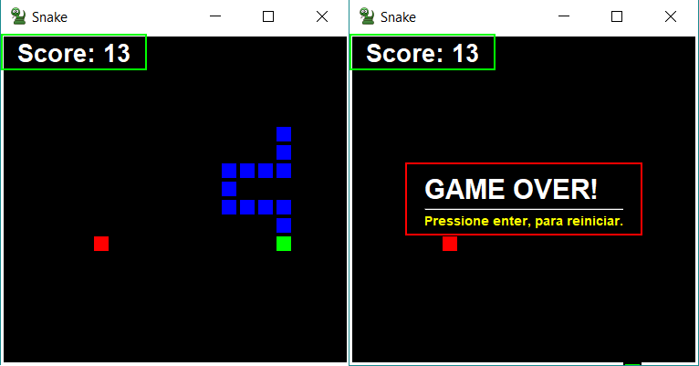

# Snake Game (Jogo da Cobrinha)

Nada mais, nada menos do que o clássico joguinho da cobrinha. Feito em Java quando eu estava iniciando neste mundão da tecnologia. Foi bem interessante fazer algo assim logo quando eu estava começando, já que eu sempre me desafio a coisas novas, se você está iniciando ou já está a um tempo se desafie também!

##### Como rodar?
Você pode baixar o arquivo '.jar' na aba **Releases** ou fazer um `git clone` do projeto em sua workspace.

##### Controles (Teclado) 
- **P** (Pausar)
- **Setas direcionais** (CIMA, BAIXO, ESQUERDA, DIREITA)

##### Como o jogo é?
Quanto maior a cobrinha, maior a dificuldade fica, pois a velocidade da cobrinha vai aumentando dando um maior desafio ao jogador.

##### Licença
MIT